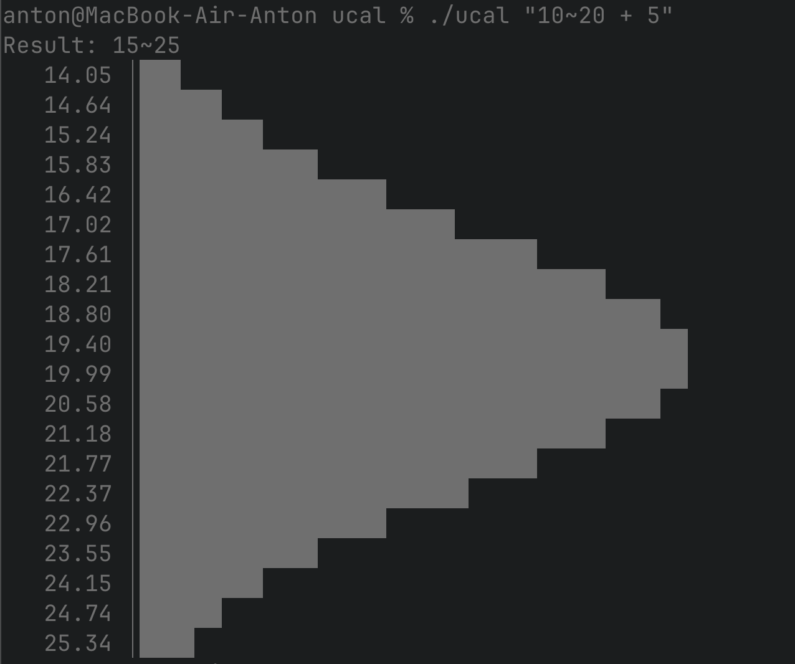
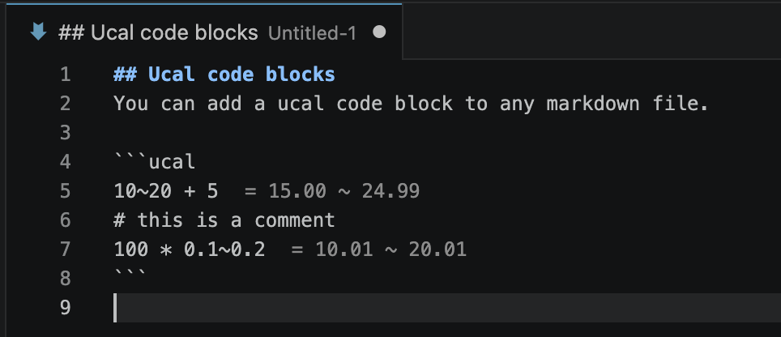

# Ucal — console unsure calculator

Inspired by [an awesome little article](https://filiph.github.io/unsure/) by Filip Hracek. The original version lives in [his repo](https://github.com/filiph/unsure).

Ucal evaluates arithmetic expressions where numbers can be ranges (e.g. `10~20`) and reports the resulting distribution via Monte Carlo simulation. See the article above for the idea and practical examples.

## Go application

A CLI that evaluates a single expression and prints a histogram of its distribution, plus a JSON-RPC server mode for editor integrations.

Build the binary with `go build` (or `just build`). It produces a single `ucal` executable in the project root with no runtime dependencies.

Pass the expression as arguments to evaluate it. The output is a percentile summary followed by an ASCII histogram across the 1–99 percentile range.

```sh
./ucal "10~20 + 5"
```



Run with `-serve` to start a JSON-RPC server over stdio. This is what the VS Code plugin talks to; it is not meant for direct human use.

```sh
./ucal -serve
```

## VS Code plugin

Source lives in `vscode-plugin/`. You can build it with:

```sh
cd vscode-plugin
npm install
npm run compile
npm run package
```

The last step produces a `.vsix` you can install in VS Code via `Extensions: Install from VSIX`. By default the plugin spawns `ucal` from `PATH` — override with the `ucal.binaryPath` setting.

The plugin exposes a `ucal: calculate expression with ranges` command that prompts for an expression and shows the `low ~ high` result. It also evaluates `ucal` fenced code blocks inside Markdown files inline: each non-comment, non-empty line is evaluated and its result is rendered next to the line.

````markdown
## Ucal code blocks
You can add a ucal code block to any markdown file.

```ucal
10~20 + 5
# this is a comment
100 * 0.1~0.2
```
````



## License

[MIT/X Consortium License](./LICENSE).
